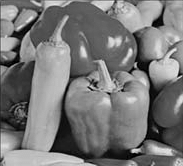

# Color Image Segmentation Using Kruskal's MST Algorithm And Graph Cuts
## Default Input File
peppers.pgm: Netpbm image data, size = 256 x 256, greymap, ASCII text


## Segmentation Lapse
Merged result of segmentation pgm files based on given cut count.


## Build
```
make build
```
## Run
Run with default parameters. Puts output pgm image file to `out` folder by default.
```
make run
```
## Running With Custom Parameters
```
./build/main <FILE_PATH> <CUT_COUNT> <OUTPUT_DIR>
```
```
Default parameters
FILE_PATH=./data/peppers.pgm
OUTPUT_DIR=./out/
CUT_COUNT=58
```

